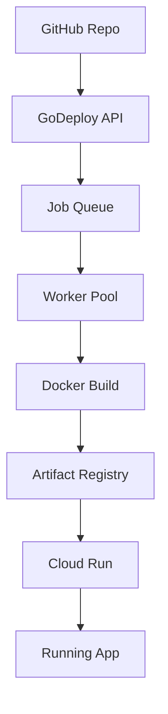

# GoDeploy Architecture Overview

```mermaid
graph TD;
    A[GitHub Repo]-->B[GoDeploy API];
    B-->C[Job Queue];
    C-->D[Worker Pool];
    D-->E[Docker Build];
    E-->F[Artifact Registry];
    F-->G[Cloud Run];
    G-->H[Running App];
```